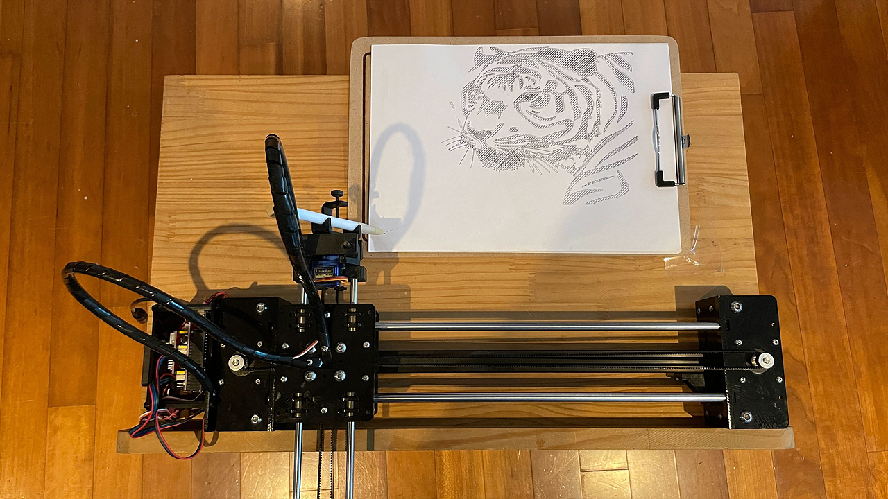
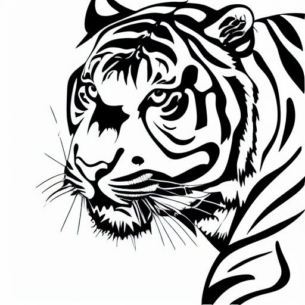
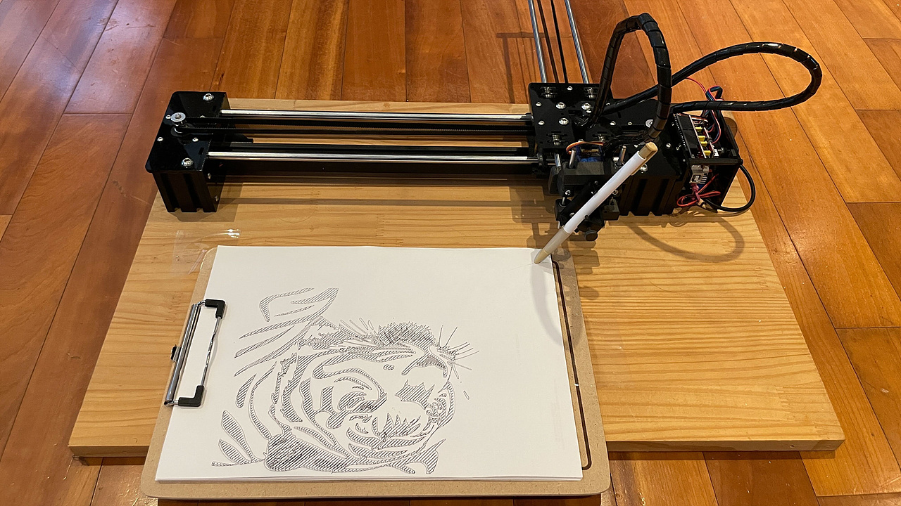
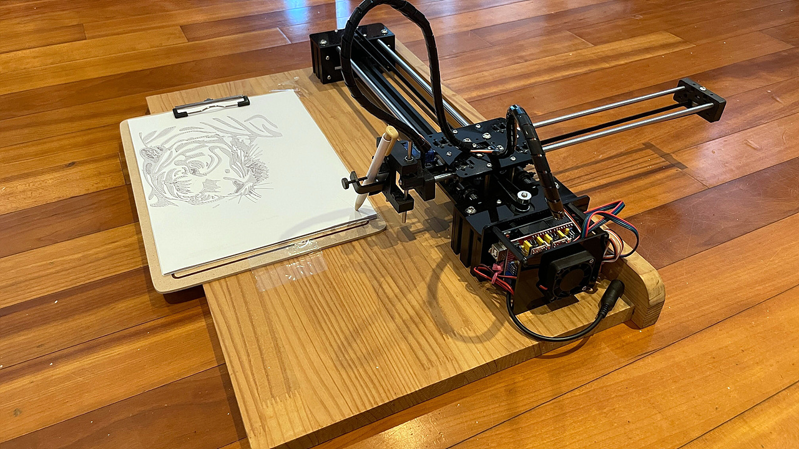
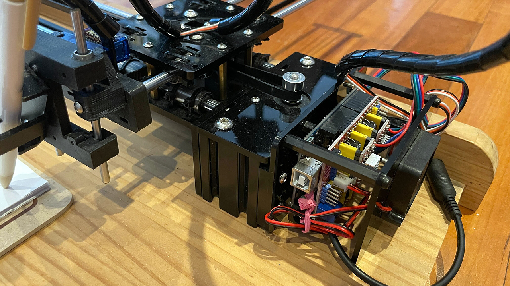

# DrawGPT (AI 기반 XY 플로팅 로봇)

## 작품 설명
1. 아두이노와 CNC 쉴드로 만든 XY 플로터
2. ChatGPT + Stable Diffusion를 이용해서 주어진 Prompt로 벡터 이미지(SVG)를 생성함

</img> 

아래 이미지는 Stable Diffusion (VectorStudio)로 생성한 이미지임 (SVG 변환)
</img> 

생성한 SVG 이미지를 플로팅 로봇으로 출력하는 모습임
</img> 

2개의 스테핑 모터와 1개의 서버 모터로 동작함 (Core XY방식으로 구현)
</img> 

아두이노 우노 보드와 CNC 쉴드를 모터 등의 제어에 이용됨
</img> 

## XY 플로터 부품 구매 및 조립 방법
페이지 준비중...

## SVG 파일로부터 gcode 생성방법
페이지 준비중...

## XY 플로터 동작 방법 및 gcode로부터 출력 방법
페이지 준비중...

## Stable Diffusion 설치 및 SVG 생성 방법
페이지 준비중...
